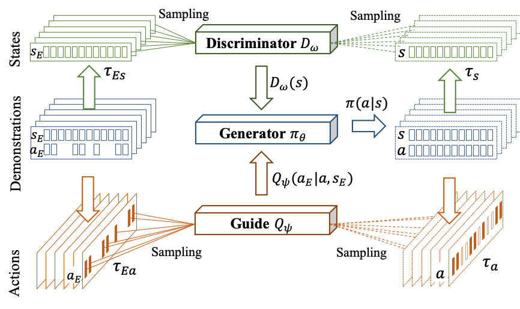
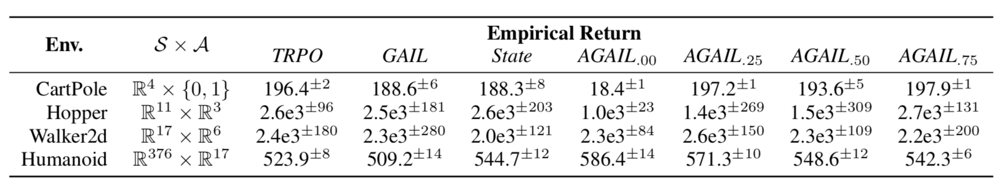
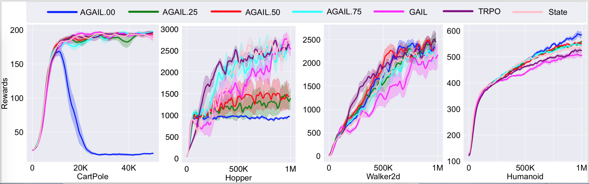

# Action-Guided Adversarial Imitation Learning


## Algorithm framework



## How to use

### 1. Download expert data 
Download expert data from this [dropbox url](https://www.dropbox.com/s/wu6fddmjk5ojrg6/expert_data.zip?dl=0). Unzip and place it in the scripts folder (i.e., *scripts/expert_data/*)

### 2. Running training scripts

This repository consists of two version of AGAIL in folder **scripts**: one for discrete actions and another for continuous actions. 

* Discrete action control:

``` python
# run a single process
python3 agail_trpo_cartpole.py --loss_percent 0.25 --seed 0 --algo agail # running agail
python3 agail_trpo_cartpole.py --loss_percent 0.25 --seed 0 --algo state # running state-GAIL
python3 agail_trpo_cartpole.py --loss_percent 0.25 --seed 0 --algo trpo # running TRPO
```
``` bash
# run multiple process, e.g., run agail
sh run_cartpole.sh 
```
(Checkpoints and logs will be written into *checkpoint* and *log_trpo_cartpole* folder)

* Continuous action control:

``` python
# run a single process
python3 agail_trpo.py --loss_percent 0.25 --env_id Hopper --expert_path expert_data/mujoco/stochastic.trpo.Hopper.0.00.npz --algo agail # running agail
python3 agail_trpo.py --loss_percent 0.25 --env_id Hopper --expert_path expert_data/mujoco/stochastic.trpo.Hopper.0.00.npz --algo state # running state-GAIL
python3 agail_trpo.py --loss_percent 0.25 --env_id Hopper --expert_path expert_data/mujoco/stochastic.trpo.Hopper.0.00.npz --algo trpo # running TRPO
```
``` bash
# run multiple process
sh run_mujoco.sh
```
(Checkpoints and logs will be written into *checkpoint* and *log_trpo_mujoco* folder)

### 3. Plotting curves
``` python
python3 plot_curve.py --env_id Hopper --timesteps 5000000
```

## Experiment outcomes
* Overall


* Effectiveness


* Robustness


## Citation & Question
If you use the repository for your research, please cite our work:
> **Adversarial Imitation Learning from Incomplete Demonstrations**
> 
> Mingfei Sun, Xiaojuan Ma
>
> International Joint Conference on Artificial Intelligence (IJCAI 2019)

If you encountered any problems when using the codes, please feel free to contact **Mingfei (mingfei.sun@ust.hk)**. Or you can create an issue in this repo. 

Visit [www.mingfeisun.com](www.mingfeisun.com) for more research projects on the relevant topics. 
